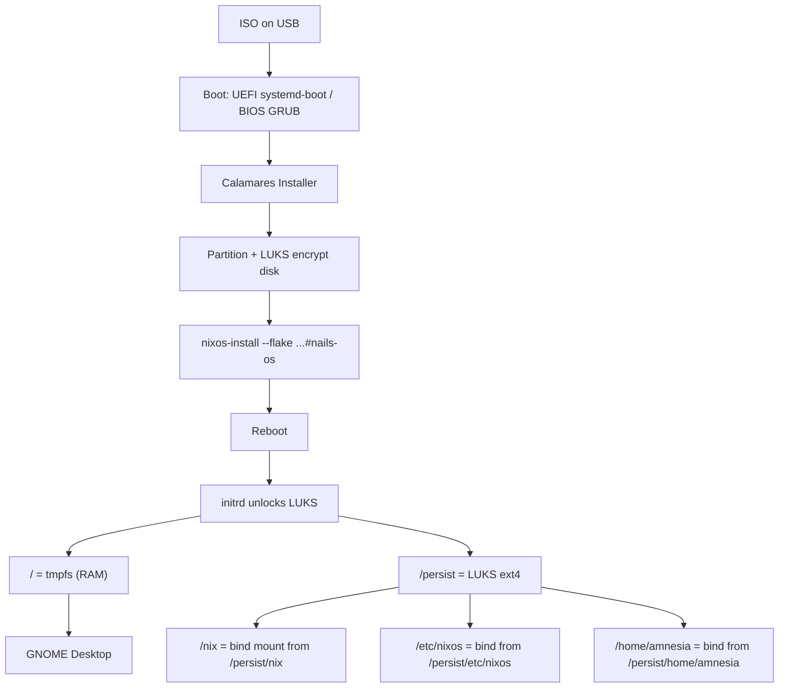
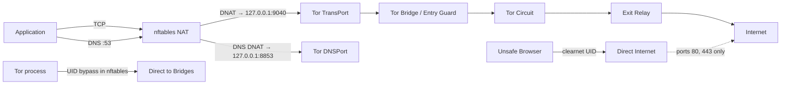
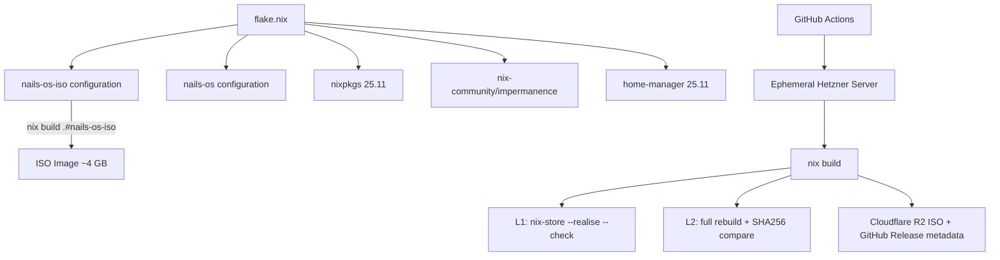

# Architecture

High-level architecture of NAILS OS — an amnesic, Tor-routed NixOS distribution.

## Overview

NAILS OS is a privacy-focused live operating system built on NixOS. It combines three core properties:

1. **Amnesia** — the root filesystem is tmpfs, wiped on every reboot. Only explicitly declared paths survive on an encrypted `/persist` volume.
2. **Tor routing** — all network traffic is transparently proxied through Tor via nftables NAT rules. DNS is resolved through Tor.
3. **Declarative reproducibility** — the entire system is defined as a Nix flake, enabling reproducible builds and auditable configuration.

The system ships as a bootable ISO containing a Calamares GUI installer. After installation, it boots into a GNOME desktop running entirely from RAM.

## Boot Flow



## Network Flow



Key nftables rules (from `modules/tor.nix`):
- All TCP from non-Tor UIDs is DNAT'd to Tor's TransPort (9040)
- All DNS is DNAT'd to Tor's DNSPort (8853)
- Tor's own UID bypasses NAT to reach bridges directly
- The `clearnet` UID (Unsafe Browser) gets limited direct access (ports 80/443) for captive portals
- All other outbound traffic is dropped by the filter chain

## Build Flow



## Flake Structure

The flake (`nix-config/flake.nix`) defines two NixOS configurations:

| Configuration | Purpose | Entry point |
|---|---|---|
| `nails-os` | Installed system | `hosts/nails-os/default.nix` |
| `nails-os-iso` | Installer ISO | `hosts/nails-os-iso/default.nix` |

Both share modules from `nix-config/modules/`:

| Module | Responsibility |
|---|---|
| `base.nix` | System-wide defaults (NixOS base settings) |
| `boot.nix` | Bootloader, initrd, kernel configuration |
| `network.nix` | MAC randomization, DNS, IPv6 disable |
| `security.nix` | Kernel hardening, AppArmor, DMA blacklist |
| `tor.nix` | Tor daemon, nftables transparent proxy, bridges, Unsafe Browser |
| `impermanence.nix` | tmpfs root, `/persist` bind mounts |
| `storage.nix` | Disk layout, LUKS, mount points |
| `packages.nix` | Application manifest (Tor Browser, KeePassXC, etc.) |
| `users.nix` | User accounts (`amnesia`) |
| `home.nix` | Home Manager integration |
| `shell-history.nix` | Shell history enable/disable |
| `home-persistence.nix` | Selective vs. full home persistence option |

The ISO configuration additionally imports the upstream `installation-cd-graphical-calamares-gnome.nix` module and bundles custom Calamares extensions.

## Calamares Installer Pipeline

The installer uses Calamares with custom NAILS OS modules. The pipeline:

```
settings.conf → UI sequence → exec sequence → nixos-install
```

### UI Sequence

1. **welcome** — language selection
2. **locale** — timezone/locale
3. **keyboard** — keyboard layout
4. **partition** — disk selection + LUKS encryption (mandatory)
5. **users** — username (locked to `amnesia`), password
6. **packagechooser@tor** — Tor (default) or Direct networking
7. **packagechooser@history** — shell history disabled (default) or enabled
8. **packagechooser@home-persistence** — selective (default) or full home persistence
9. **summary** — review before install

### Exec Sequence

1. **partition** — creates partitions (EFI: FAT32 + LUKS2 system volume; BIOS: MBR + single LUKS1 system volume)
2. **mount** — mounts target filesystem
3. **nails-os** — custom Python module (`modules/nails-os/main.py`) that:
   - Copies the flake from `/etc/nixos` to the target
   - Detects boot mode (EFI/BIOS) and partition UUIDs
   - Generates `hardware-configuration.nix` with tmpfs `/`, `/persist`, `/nix` bind
   - Writes `boot-mode.nix` (systemd-boot or GRUB)
   - Writes `hostname.nix`, `locale.nix`, `secrets.nix`
    - Writes `network-mode.nix` if Direct mode chosen
   - Writes `shell-history-mode.nix` if history enabled
   - Writes `home-persistence-mode.nix` if full home chosen
   - Runs `nixos-install --flake <target>/etc/nixos#nails-os`
4. **umount** — unmounts target

### Generated Configuration Files

The `nails-os` exec module writes `.nix` files into `hosts/nails-os/` on the target. These are conditionally imported using `lib.optional (builtins.pathExists ...)` so the flake evaluates cleanly before installation:

| File | Written when | Controls |
|---|---|---|
| `boot-mode.nix` | Always | systemd-boot (EFI) or GRUB (BIOS) |
| `locale.nix` | Always | Timezone, locale, keyboard |
| `hostname.nix` | Always | System hostname |
| `network-mode.nix` | User chose Direct | Disables Tor, sets Quad9 DNS |
| `shell-history-mode.nix` | User enabled history | Enables shell history |
| `home-persistence-mode.nix` | User chose full home | Switches from selective to full home persistence |

## Security Model

### Kernel Hardening (`security.nix`)

- Memory zeroing on alloc and free (`init_on_alloc=1`, `init_on_free=1`)
- SLAB merge disabled, SLUB debug flags
- AppArmor enabled
- DMA attack surface removed: FireWire, Thunderbolt, USB4 kernel modules blacklisted
- SMT disabled (Spectre/MDS mitigation)
- `kexec` disabled, BPF JIT hardened
- No swap (prevents data persistence)
- `haveged` for entropy

### Network Isolation (`tor.nix`)

- nftables `inet filter` drops all outbound traffic not matching Tor UID, clearnet UID, or RFC1918
- DNS is forcibly redirected to Tor's DNSPort while Tor mode is enabled
- Tor's own UID gets a separate DNS DNAT to Quad9 (9.9.9.9) so bundled pluggable transports can resolve broker addresses before circuits exist
- Direct mode disables Tor and its transparent-proxy rules via `network-mode.nix`
- The Unsafe Browser runs as the `clearnet` UID with access limited to ports 80/443
- IPv6 is disabled system-wide

### Impermanence (`impermanence.nix`)

- Root is tmpfs — all state is destroyed on power-off
- Only declared paths persist on the encrypted `/persist` volume
- Selective home persistence (default) limits persisted directories to user content (Documents, Downloads, etc.) and cryptographic identities (.ssh, .gnupg, keyrings)
- Full home persistence is opt-in via the installer

### Disk Encryption

- The installer refuses to proceed without disk encryption
- UEFI installs use LUKS2 for the encrypted system volume
- BIOS installs use a single LUKS1-encrypted system volume so GRUB can unlock it, which also causes a double passphrase prompt at boot
- See [`docs/BIOS-SECURITY.md`](docs/BIOS-SECURITY.md) for BIOS/legacy boot limitations
