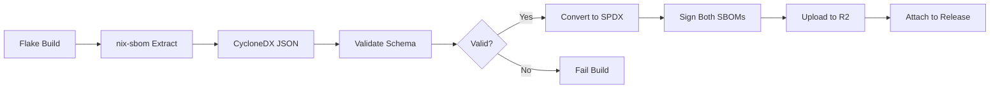
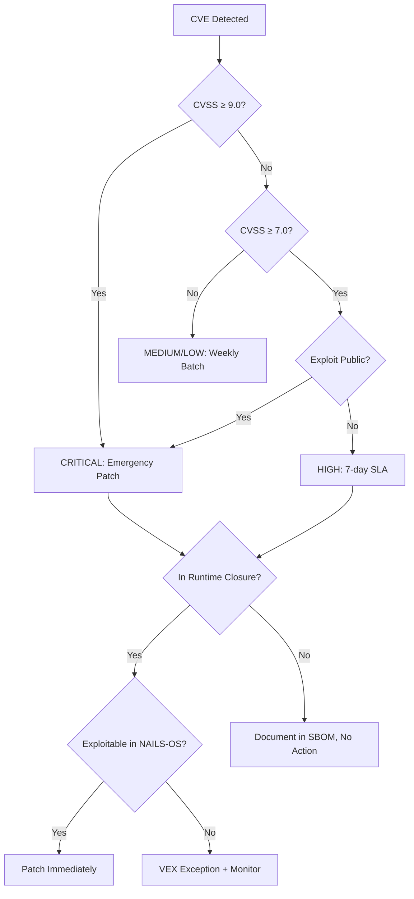
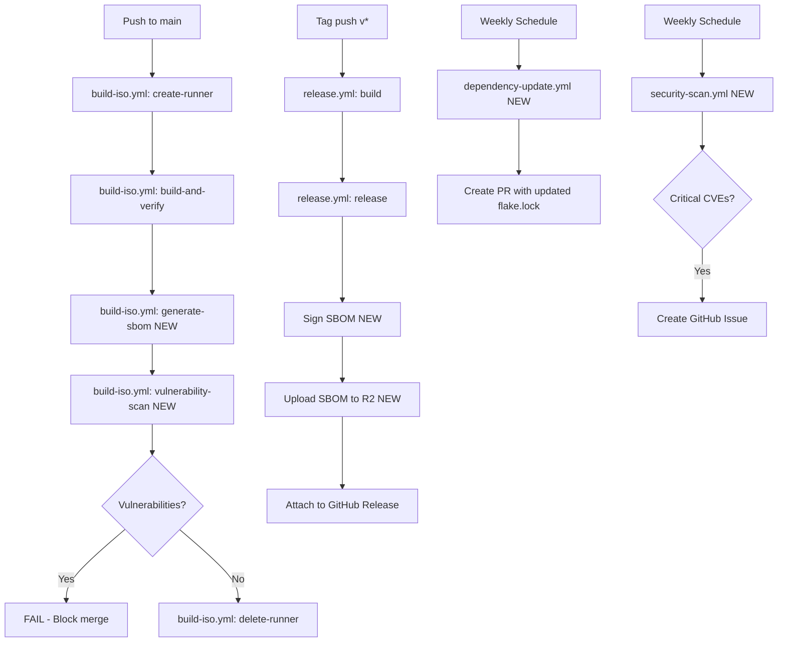

# SBOM, Dependency Pinning, and Vulnerability Management Architecture

**NAILS-OS Security Supply Chain Strategy**

Version: 1.0
Status: Design Document
Date: 2026-03-24

---

## Executive Summary

This document defines the architecture for Software Bill of Materials (SBOM) generation, dependency pinning, and vulnerability management for NAILS-OS, a privacy-focused NixOS-based amnesic operating system. The strategy leverages NixOS's inherent reproducibility guarantees (`flake.lock` as a cryptographic dependency manifest) while adding defense-in-depth through automated SBOM generation, multi-layer vulnerability scanning, and structured update policies. The design prioritizes zero-cost or low-cost tooling to respect the €20/month Hetzner budget, automates security gates in CI/CD, and establishes a 3-layer documentation hierarchy for transparency. Implementation will occur in 3 phases over 8-12 weeks, with immediate quick wins (pre-commit CVE scanning) followed by full CI integration and advanced reachability analysis.

---

## Current Canonical Interfaces

To align with current repository implementation, use these canonical interfaces:

```bash
nix build ./nix-config#sbom
nix run ./nix-config#vulnix-scan -- <target> <output>
```

Canonical output artifacts:

- `dist/nails-os-sbom.cdx.json`
- `dist/vulnix-results.json`

## 1. SBOM Strategy for NixOS

### 1.1 Format Selection: CycloneDX 1.6 (Primary) + SPDX 2.3 (Secondary)

**Decision: CycloneDX 1.6 as primary format, with SPDX 2.3 generated for regulatory compliance.**

**Rationale:**

- **CycloneDX advantages:**
  - Native vulnerability modeling (VEX integration for exploitability assessment)
  - Stronger dependency relationship graphs (critical for NixOS closure analysis)
  - Better tooling ecosystem for continuous security (supports VDR - Vulnerability Disclosure Reports)
  - JSON schema is more compact and parseable than SPDX's verbose RDF

- **SPDX advantages:**
  - ISO/IEC 5962:2021 standard (regulatory compliance for government/enterprise adopters)
  - Stronger licensing metadata (GPL compliance auditing)
  - Better NTIA minimum elements compliance

- **Why both:** Generate CycloneDX for operational security scanning (CI/CD gates, vulnerability tracking), generate SPDX for compliance artifacts (release assets, GPL auditing, archival). Storage cost is negligible (~100KB per SBOM).

### 1.2 Tool Selection: nix-sbom (Primary) + Custom Runtime Extraction (Fallback)

**Primary: `nix-sbom` (https://github.com/tiiuae/nix-sbom)**

- **Capabilities:**
  - Generates CycloneDX SBOMs from Nix derivations
  - Traverses full closure graph (all runtime dependencies)
  - Supports `flake.lock` introspection
  - Outputs JSON (CycloneDX 1.5 - we'll request 1.6 support or post-process)

- **Limitations:**
  - No SPDX support (we'll bridge with `cyclonedx-cli convert`)
  - Requires Nix evaluation (cannot run on non-Nix CI runners)

**Secondary: Custom extraction script**

- For environments where `nix-sbom` is unavailable (e.g., GitHub-hosted runners post-release), extract from `build-metadata.json` + `flake.lock`
- Script: `scripts/generate-sbom-fallback.sh` (to be implemented in Phase 2)

**Alternative considered: nixpkgs-review**

- Rejected: `nixpkgs-review` is for PR review automation, not SBOM generation. It evaluates package impact but doesn't produce machine-readable BOM.

**Alternative considered: syft**

- Rejected: `syft` is excellent for container/filesystem scanning but doesn't understand Nix closures or `flake.lock`. Would miss transitive runtime dependencies unique to NixOS.

### 1.3 Inventory Scope: ISO Runtime Dependencies (Primary) + Build-Time Metadata (Secondary)

**What to inventory:**

1. **ISO runtime closure (REQUIRED):**
   - All packages in the ISO's Nix store path
   - Derivation: `self.nixosConfigurations.nails-os-iso.config.system.build.isoImage`
   - Includes kernel, systemd, GNOME, Tor, all user applications
   - **Why:** This is what users boot and execute - highest security impact

2. **Installed system runtime closure (REQUIRED):**
   - All packages in the installed system's toplevel derivation
   - Derivation: `self.nixosConfigurations.nails-os.config.system.build.toplevel`
   - **Why:** Installed systems may have a different package set than the ISO

3. **Build-time dependencies (METADATA ONLY):**
   - Record in SBOM metadata but do NOT include in component inventory
   - Examples: `nixfmt`, `diffoscope`, build toolchain
   - **Why:** Not shipped to users, but needed for build reproducibility auditing

**What NOT to inventory:**

- Nix itself (shipped as part of ISO but not in installed system by default)
- Pre-commit hooks (developer tooling, not runtime)
- CI runner dependencies (ephemeral infrastructure)

### 1.4 SBOM Generation Pipeline



**Pipeline stages:**

1. **Generation (post-ISO build):**
   ```bash
   nix run github:tiiuae/nix-sbom -- \
     ./nix-config#nails-os-iso \
     --output dist/nails-os-sbom.cdx.json \
     --include-dev false
   ```

2. **Validation:**
   ```bash
   cyclonedx-cli validate \
     --input-file dist/nails-os-sbom.cdx.json \
     --input-version v1_6 \
     --fail-on-errors
   ```

3. **SPDX conversion:**
   ```bash
   cyclonedx-cli convert \
     --input-file dist/nails-os-sbom.cdx.json \
     --output-file dist/nails-os-sbom.spdx.json \
     --output-format spdxjson \
     --output-version v2_3
   ```

4. **Signing (Sigstore):**
   ```bash
   cosign sign-blob \
     --bundle dist/nails-os-sbom.cdx.json.bundle \
     dist/nails-os-sbom.cdx.json
   ```

5. **Upload to R2 + GitHub Release:**
   - R2: `${R2_PREFIX}/sbom/nails-os-${VERSION}-sbom.cdx.json`
   - Release assets: both `.cdx.json` and `.spdx.json`

### 1.5 Versioning & Storage

**Versioning scheme:**

- ISO filename correlation: `nails-os-${VERSION}-${NIXPKGS_REV}-sbom.cdx.json`
- Example: `nails-os-0.1.0-fa56d7d-sbom.cdx.json`
- Git tag correlation: SBOM metadata includes `git.commit` field from `build-metadata.json`

**Storage locations:**

1. **Release artifacts (GitHub Releases):**
   - `nails-os-${VERSION}-sbom.cdx.json` (primary)
   - `nails-os-${VERSION}-sbom.spdx.json` (compliance)
   - `nails-os-${VERSION}-sbom.cdx.json.bundle` (Sigstore signature)
   - Retention: Permanent (tied to release lifecycle)

2. **Cloudflare R2:**
   - Path: `stable/sbom/` (releases) and `latest/sbom/` (rolling builds)
   - Retention: 90 days for `latest/`, permanent for `stable/`
   - **Why:** Fast CDN distribution, decouples from GitHub rate limits

3. **Git repository (optional):**
   - Path: `sbom/nails-os-${VERSION}-sbom.cdx.json`
   - Tracked in git history for diffing dependency changes across versions
   - Retention: Permanent (git history)
   - **Why:** Enables `git diff` to audit dependency additions/removals between releases

**Recommendation:** Store in all 3 locations. Git storage adds ~100KB per release but enables powerful historical analysis. Use `.gitattributes` to mark as binary to prevent merge conflicts.

### 1.6 CI/CD Integration Points

**Pre-commit hook (local development):**

- **NOT RECOMMENDED:** SBOM generation is expensive (requires full closure evaluation). Skip in pre-commit.

**CI: `build-iso.yml` - New step after "Generate build metadata":**

```yaml
- name: Generate SBOM
  id: sbom
  run: |
    # Install nix-sbom and cyclonedx-cli
    nix profile install github:tiiuae/nix-sbom
    nix shell nixpkgs#cyclonedx-gomod -c cyclonedx-cli --version

    # Generate CycloneDX SBOM
    nix-sbom ./nix-config#nails-os-iso \
      --output dist/nails-os-sbom.cdx.json

    # Validate
    cyclonedx-cli validate \
      --input-file dist/nails-os-sbom.cdx.json \
      --fail-on-errors

    # Convert to SPDX
    cyclonedx-cli convert \
      --input-file dist/nails-os-sbom.cdx.json \
      --output-file dist/nails-os-sbom.spdx.json \
      --output-format spdxjson

    # Inject version metadata
    jq --arg version "$(jq -r '.version' dist/build-metadata.json)" \
       --arg commit "$(jq -r '.git.commit' dist/build-metadata.json)" \
       '.metadata.component.version = $version | .metadata.properties += [{"name": "git:commit", "value": $commit}]' \
       dist/nails-os-sbom.cdx.json > dist/nails-os-sbom.cdx.json.tmp
    mv dist/nails-os-sbom.cdx.json.tmp dist/nails-os-sbom.cdx.json

    echo "sbom_generated=true" >> "$GITHUB_OUTPUT"
```

**CI: `release.yml` - Sign and upload SBOMs:**

```yaml
- name: Sign SBOM with Sigstore
  if: steps.repo.outputs.is_public == 'true'
  run: |
    cosign sign-blob \
      --bundle dist/nails-os-sbom.cdx.json.bundle \
      dist/nails-os-sbom.cdx.json

- name: Upload SBOMs to release
  run: |
    gh release upload "${{ steps.meta.outputs.tag }}" \
      dist/nails-os-sbom.cdx.json \
      dist/nails-os-sbom.spdx.json \
      dist/nails-os-sbom.cdx.json.bundle
```

**Cost impact:**

- SBOM generation adds ~2-3 minutes to build time (negligible - Nix closures are cached)
- No additional Hetzner costs (runs on same ephemeral runner)
- R2 storage: ~300KB per release (24 releases/year = 7.2MB/year)
- **Total additional cost: €0.00/month**

---

## 2. Dependency Pinning Policy

### 2.1 Current State Analysis: Automatic `flake.lock` Updates

**Current mechanism (`.pre-commit-config.yaml`):**

```yaml
- id: nix-flake-update
  name: nix flake update and commit
  entry: bash
  language: system
  pass_filenames: false
  always_run: true
  args:
    - -c
    - |
      echo "Updating flake.lock..."
      nix flake update ./nix-config
      git add nix-config/flake.lock
```

**Current behavior:**

- **Every commit triggers `nix flake update`** - updates ALL inputs to latest
- Automatically staged in the same commit
- No human review of changes
- No CVE scan before accepting updates

**Risk assessment:**

- ⚠️ **HIGH RISK:** Untested dependency updates auto-committed to main
- ⚠️ **MODERATE RISK:** No rollback mechanism if update breaks build
- ⚠️ **LOW RISK:** Flake inputs are pinned to specific commits (reproducible)

**Problems:**

1. **No review process:** Dependency updates bypass code review
2. **No CVE scanning:** Could update TO a vulnerable version
3. **No testing gate:** Could break ISO build without detection
4. **No changelog visibility:** Developers don't see what changed

### 2.2 Proposed Update Policy: Controlled Weekly Updates

**Policy:**

1. **Frequency:** Weekly automated PRs (Sundays 00:00 UTC)
2. **Review requirement:** ALL dependency updates must pass CI + human approval
3. **Emergency patches:** Critical CVEs trigger immediate manual updates (see 3.4)
4. **Stable vs unstable tracking:**
   - `nixpkgs`: Track `nixos-25.11` (stable release branch)
   - `home-manager`: Track `release-25.11` (follows nixpkgs stable)
   - `impermanence`: Track `master` (no release branches, low velocity)

**Automated PR workflow (new):**

- GitHub Actions workflow: `.github/workflows/dependency-update.yml`
- Triggers: `schedule: cron: '0 0 * * 0'` (weekly, Sunday midnight UTC)
- Creates PR with:
  - Updated `flake.lock`
  - Automated changelog (diff of pinned commits)
  - CI status (build + vulnerability scan)
  - Approval requirement from maintainer

### 2.3 Semantic Versioning Strategy for Nixpkgs

**Challenge:** Nixpkgs doesn't use semantic versioning - it's a rolling release with stable branches.

**Our approach:**

1. **Stable branch tracking:**
   - Pin to `nixos-25.11` (current NixOS stable)
   - Update to `nixos-26.05` only during major NAILS-OS releases (6-month cycle)
   - Rationale: Stable branches receive only security backports, not breaking changes

2. **Version pinning in flake.lock:**
   - Each input is pinned to a specific Git commit SHA
   - `flake.lock` is cryptographically signed (Nix verifies narHash)
   - Updates are atomic: all inputs update together, tested as a unit

3. **Rollback mechanism:**
   - Git history preserves every `flake.lock` state
   - Rollback: `git checkout <previous-commit> nix-config/flake.lock`
   - Emergency rollback in release.yml: tag previous known-good commit

4. **Version metadata in SBOM:**
   - Each package in SBOM includes:
     - `purl` (Package URL): `pkg:nix/nixpkgs/firefox@133.0.3`
     - `version`: Upstream package version
     - `externalReferences`: Link to nixpkgs commit in GitHub

### 2.4 Approval Workflow for Dependency Updates

**Automated PR workflow (`.github/workflows/dependency-update.yml`):**

```yaml
name: Weekly Dependency Update

on:
  schedule:
    - cron: '0 0 * * 0'  # Sunday midnight UTC
  workflow_dispatch:

jobs:
  update-dependencies:
    runs-on: ubuntu-latest
    steps:
      - uses: actions/checkout@v4

      - name: Update flake.lock
        run: |
          nix flake update ./nix-config

      - name: Generate changelog
        run: |
          # Compare old vs new flake.lock
          git diff nix-config/flake.lock | tee flake-update-diff.txt

          # Extract updated package commits
          python3 scripts/extract-flake-changes.py > CHANGELOG.md

      - name: Create Pull Request
        uses: peter-evans/create-pull-request@v6
        with:
          branch: deps/weekly-update-${{ github.run_number }}
          title: "deps: Weekly dependency update (nixpkgs, home-manager)"
          body-path: CHANGELOG.md
          labels: dependencies,automated
          reviewers: WitteShadovv
```

**Human review checklist (PR template):**

```markdown
## Dependency Update Checklist

- [ ] CI build passes (ISO builds successfully)
- [ ] Vulnerability scan passes (no new HIGH/CRITICAL CVEs)
- [ ] Reproducibility verification passes (L1 + L2)
- [ ] Changelog reviewed (no unexpected package additions/removals)
- [ ] Test boot in QEMU (spot-check for regressions)

**Auto-merge criteria:** ALL checks pass + no HIGH/CRITICAL CVEs + 24hr soak time
```

**Auto-merge conditions (optional - Phase 3):**

- All CI checks pass
- No new HIGH/CRITICAL CVEs introduced
- 24-hour soak time (allows community review)
- Use `peter-evans/enable-pull-request-automerge` GitHub Action

### 2.5 GPL Compliance Retention: 3-Year Snapshot Archive

**Requirement (GPLv3 compliance):**

- NAILS-OS is GPLv3 - we must provide source code for 3 years
- NixOS: Source = `flake.lock` + nixpkgs archive
- Users must be able to reproduce builds from historical snapshots

**Implementation:**

1. **Archive `flake.lock` in git forever:**
   - Already happening (git history is permanent)
   - Tag every release: `git tag v0.1.0` pins the exact `flake.lock` state

2. **Archive nixpkgs snapshots (not needed - upstream does this):**
   - Nixpkgs commit SHAs in `flake.lock` are permanent
   - `cache.nixos.org` retains binaries indefinitely
   - Hydra build logs are archived
   - **No action needed from NAILS-OS**

3. **Retain SBOM for 3 years:**
   - GitHub Releases: Permanent (not auto-deleted)
   - R2 stable/ prefix: Lifecycle policy = 3 years
   - Git repository `sbom/` directory: Permanent

**Lifecycle policy (Cloudflare R2):**

- `stable/`: Retain for 1095 days (3 years) from upload date
- `latest/`: Retain for 90 days (rolling builds expire)
- SBOMs under `stable/sbom/`: Same 3-year retention

**Cost:** Negligible (24 releases × 3 years × 300KB SBOM + 4GB ISO = ~300GB over 3 years, well within free tier)

### 2.6 Pre-Commit Hook Redesign

**Current hook (problematic):**

```yaml
- id: nix-flake-update
  name: nix flake update and commit
  always_run: true  # ← Updates on EVERY commit
```

**New hook (validation only):**

```yaml
- id: flake-lock-check
  name: flake.lock is up to date
  entry: bash
  language: system
  files: flake\.(nix|lock)$
  always_run: true
  pass_filenames: false
  args:
    - -c
    - "nix flake lock --no-update-lock-file ./nix-config"
```

**Behavior:**

- Validates `flake.lock` matches `flake.nix` inputs
- Does NOT update - fails if lock file is stale
- Developer must explicitly run `nix flake update` to update
- Updates only happen via weekly automated PRs or manual intervention

**Migration:**

- Remove old `nix-flake-update` hook
- Keep existing `flake-lock-check` hook (already present - line 80 of current `.pre-commit-config.yaml`)
- Update `.pre-commit-config.yaml` in Phase 1

---

## 3. Vulnerability Scanning Architecture

### 3.1 Tool Selection: Multi-Layer Stack

**Layer 1: Pre-commit (Local Development)**

- **Tool:** `vulnix` (https://github.com/nix-community/vulnix)
- **Why:** Native Nix/NVD integration, runs locally, fast
- **Scope:** Scan only changed derivations (incremental)
- **Threshold:** WARN on any CVE, fail on CRITICAL with CVSS ≥ 9.0
- **Frequency:** Every commit (via pre-commit hook)

**Layer 2: CI Pull Request Gate**

- **Tool:** `vulnix` + `nix-security-tracker` (https://github.com/Nix-Security-WG/nix-security-tracker)
- **Why:** Authoritative NixOS Security Tracker data (maintained by NixOS Security team)
- **Scope:** Full ISO runtime closure
- **Threshold:** FAIL on HIGH/CRITICAL (CVSS ≥ 7.0) with `status: open`
- **Frequency:** Every PR, every push to main

**Layer 3: Scheduled Weekly Scans**

- **Tool:** `grype` (Anchore) scanning SBOM + `vulnix` as backup
- **Why:** Third-party validation, catches CVEs not in NVD yet (GitHub Security Advisory DB)
- **Scope:** Full ISO + SBOM
- **Threshold:** Report all findings, fail on CRITICAL unfixed for >7 days
- **Frequency:** Weekly (Mondays 00:00 UTC, before dependency update on Sunday)

**Layer 4: Release Gate**

- **Tool:** All of the above + manual review
- **Why:** Human-in-the-loop for risk acceptance
- **Scope:** Full SBOM + exploit prediction analysis
- **Threshold:** ZERO critical exploitable CVEs, document accepted risks for others
- **Frequency:** Every release (triggered by tag push or manual dispatch)

### 3.2 Multi-Layer Scanning Implementation

**Pre-commit hook (`.pre-commit-config.yaml`):**

```yaml
- id: vulnix-scan
  name: vulnix CVE scan
  entry: bash
  language: system
  files: \.nix$
  pass_filenames: false
  args:
    - -c
    - |
      # Scan the main toplevel derivation (not ISO - too slow for pre-commit)
      vulnix --json ./nix-config#nixosConfigurations.nails-os.config.system.build.toplevel \
        | jq -e '.[].cvssv3_basescore < 9.0' \
        || { echo "CRITICAL CVE detected (CVSS ≥ 9.0)"; exit 1; }
```

**CI: `build-iso.yml` - New job after build-and-verify:**

```yaml
  vulnerability-scan:
    needs: build-and-verify
    runs-on: ubuntu-latest
    steps:
      - uses: actions/checkout@v4

      - name: Install Nix
        uses: DeterminateSystems/nix-installer-action@main

      - name: Scan with vulnix
        run: |
          nix shell nixpkgs#vulnix -c vulnix \
            --json ./nix-config#nails-os-iso \
            > vulnix-results.json

          # Fail on HIGH/CRITICAL with open status
          jq -e '[.[] | select(.cvssv3_basescore >= 7.0)] | length == 0' vulnix-results.json \
            || { echo "HIGH/CRITICAL CVEs detected"; exit 1; }

      - name: Scan SBOM with grype
        run: |
          # Download SBOM from previous job (via artifact or R2)
          curl -fsSL "${{ vars.R2_PUBLIC_URL }}/latest/sbom/nails-os-sbom.cdx.json" -o sbom.json

          # Scan with grype
          nix shell nixpkgs#grype -c grype sbom:sbom.json \
            -o json > grype-results.json

          # Fail on CRITICAL unfixed vulnerabilities
          jq -e '[.matches[] | select(.vulnerability.severity == "Critical")] | length == 0' grype-results.json \
            || { echo "CRITICAL CVEs detected in SBOM"; exit 1; }

      - name: Upload scan results
        if: always()
        uses: actions/upload-artifact@v7
        with:
          name: vulnerability-scan-results
          path: |
            vulnix-results.json
            grype-results.json
```

**CI: New workflow `.github/workflows/security-scan.yml` (weekly scheduled):**

```yaml
name: Weekly Security Scan

on:
  schedule:
    - cron: '0 0 * * 1'  # Monday midnight UTC
  workflow_dispatch:

jobs:
  full-scan:
    runs-on: ubuntu-latest
    steps:
      - uses: actions/checkout@v4

      - name: Install Nix
        uses: DeterminateSystems/nix-installer-action@main

      - name: Download latest SBOM
        run: |
          curl -fsSL "${{ vars.R2_PUBLIC_URL }}/latest/sbom/nails-os-sbom.cdx.json" -o sbom.json

      - name: Scan with grype
        run: |
          nix shell nixpkgs#grype -c grype sbom:sbom.json \
            -o table --fail-on critical

      - name: Scan with vulnix
        run: |
          nix shell nixpkgs#vulnix -c vulnix \
            ./nix-config#nails-os-iso \
            --json > vulnix-weekly.json

          # Extract vulnerabilities older than 7 days
          jq -e '[.[] | select(.cvssv3_basescore >= 9.0 and (.issued | fromdateiso8601 < (now - 604800)))] | length == 0' vulnix-weekly.json \
            || { echo "Unfixed CRITICAL CVEs >7 days old"; exit 1; }

      - name: Create GitHub Issue if vulnerabilities found
        if: failure()
        uses: actions/github-script@v7
        with:
          script: |
            github.rest.issues.create({
              owner: context.repo.owner,
              repo: context.repo.repo,
              title: '🚨 Weekly security scan found vulnerabilities',
              body: 'See workflow run: ${{ github.server_url }}/${{ github.repository }}/actions/runs/${{ github.run_id }}',
              labels: ['security', 'vulnerability']
            })
```

### 3.3 Severity Thresholds

**CVSS v3.1 severity mapping:**

| CVSS Score | Severity | Pre-commit | CI (PR/main) | Weekly Scan | Release Gate |
|------------|----------|------------|--------------|-------------|--------------|
| 0.0 - 3.9  | LOW      | Pass       | Pass         | Report      | Pass         |
| 4.0 - 6.9  | MEDIUM   | Warn       | Pass         | Report      | Review       |
| 7.0 - 8.9  | HIGH     | Warn       | **FAIL**     | **FAIL**    | **BLOCK**    |
| 9.0 - 10.0 | CRITICAL | **FAIL**   | **FAIL**     | **FAIL**    | **BLOCK**    |

**Special cases:**

1. **Exploitability assessment (Phase 3):**
   - Use VEX (Vulnerability Exploitability eXchange) in CycloneDX SBOM
   - Mark CVEs as `not_affected` if code path is unreachable in NAILS-OS
   - Example: Server-side RCE in a package we only use for client operations

2. **False positive handling:**
   - Maintain allowlist in `security/cve-exceptions.json`
   - Format: `{"CVE-2024-1234": {"reason": "Not exploitable in our configuration", "expires": "2026-12-31"}}`
   - Review quarterly, expire old exceptions

3. **Transitive dependencies:**
   - NixOS advantage: Full closure graph visibility
   - If vulnerable package is runtime dependency but never executed → mark as `not_affected` with VEX
   - Still report in SBOM (transparency) but don't block build

### 3.4 Emergency Patch Process

**Trigger:** CRITICAL CVE (CVSS ≥ 9.0) disclosed in a NAILS-OS runtime component.

**SLA:** Patch within 48 hours of NixOS security advisory publication.

**Process:**

1. **Detection (automated):**
   - Weekly scan finds CRITICAL CVE
   - GitHub Issue auto-created with `security` + `critical` labels
   - Notification sent to maintainer (GitHub watch settings)

2. **Assessment (manual - 2 hours):**
   - Verify CVE applicability to NAILS-OS threat model
   - Check if exploit exists in the wild (CISA KEV, Metasploit DB)
   - Determine if affected package is runtime dependency (check SBOM)

3. **Patching (manual - 24 hours):**
   - Option A: Update nixpkgs input to commit with backported fix
   - Option B: Apply NixOS overlay with upstream patch
   - Option C: Temporarily remove affected package from ISO (if non-critical)

4. **Testing (automated - 4 hours):**
   - Trigger `build-iso.yml` workflow with `verify_reproducibility: true`
   - Run vulnerability scan to confirm CVE is resolved
   - Test boot in QEMU

5. **Release (automated - 2 hours):**
   - Tag emergency release: `v0.1.1-cve-2024-1234`
   - Trigger `release.yml` workflow
   - Update SECURITY.md with CVE details and remediation timeline

6. **Communication (manual - 1 hour):**
   - Publish GitHub Security Advisory (GHSA)
   - Update SECURITY.md with postmortem
   - Notify users via README badge or pinned issue

**Total SLA:** 48 hours from detection to published emergency release.

### 3.5 NixOS Security Announcements Integration

**Source:** https://nixos.org/security.html (RSS feed available)

**Implementation:**

1. **RSS monitoring (automated):**
   - GitHub Action: `.github/workflows/nixos-security-monitor.yml`
   - Polls RSS feed daily (cron: `0 12 * * *`)
   - Parses for CVEs affecting packages in our SBOM
   - Cross-references with SBOM component list

2. **Alert routing:**
   - If match found → create GitHub Issue with `security` label
   - Issue template includes:
     - CVE ID and CVSS score
     - Affected package and version
     - Whether package is in our runtime closure (SBOM lookup)
     - Suggested remediation (update to commit SHA from advisory)

3. **Manual override:**
   - Maintainer can dismiss issue if false positive
   - Add to `security/cve-exceptions.json` with reasoning

**Cost:** €0 (runs on GitHub-hosted runners, <1 minute/day)

### 3.6 Reachability Analysis (Phase 3 - Advanced)

**Goal:** Determine if a CVE in our dependency tree is actually exploitable in NAILS-OS's configuration.

**Challenge:** Static analysis for NixOS is limited (no call graph tracing like cargo-geiger for Rust).

**Pragmatic approach:**

1. **Configuration-based analysis:**
   - Many CVEs require specific software configurations (e.g., LDAP enabled, specific kernel module loaded)
   - Cross-reference CVE requirements with NAILS-OS NixOS modules
   - Example: CVE in Avahi multicast DNS → we disable Avahi → mark as `not_affected`

2. **Manual code review:**
   - For CRITICAL CVEs, manually inspect if vulnerable code path is reachable
   - Document findings in VEX statements within SBOM

3. **Runtime testing (future):**
   - Integrate exploit POCs (proof-of-concept) into test suite
   - If exploit fails against NAILS-OS → mark as `not_affected`
   - Requires sandboxed exploit execution environment (complex, Phase 4+)

**VEX implementation in SBOM:**

```json
{
  "vulnerabilities": [
    {
      "id": "CVE-2024-1234",
      "source": {
        "name": "NVD",
        "url": "https://nvd.nist.gov/vuln/detail/CVE-2024-1234"
      },
      "ratings": [{"severity": "high", "score": 8.1, "method": "CVSSv3"}],
      "analysis": {
        "state": "not_affected",
        "justification": "code_not_reachable",
        "detail": "Avahi is disabled in NAILS-OS configuration (nix-config/modules/network.nix:42)"
      }
    }
  ]
}
```

---

## 4. Documentation Strategy

### 4.1 Three-Layer Hierarchy (NAILS Reference Pattern)

**Layer 1: External (User-Facing)**

- **File:** `docs/SECURITY.md` (already exists - will expand)
- **Audience:** End users, security researchers, auditors
- **Content:**
  - Responsible disclosure policy (where to report vulnerabilities)
  - Security update policy (SLA for patching CVEs)
  - Known limitations (evil maid attacks, BIOS boot risks - already documented)
  - How to verify ISO integrity (SBOM verification, attestation)
  - Security advisories archive (link to GitHub Security Advisories)

**Layer 2: Internal (Maintainer Process)**

- **File:** `docs/VULNERABILITY-HANDLING.md` (new)
- **Audience:** Project maintainers, contributors with commit access
- **Content:**
  - Emergency patch process (detailed workflow from 3.4)
  - CVE triage decision tree (exploit in the wild? affects threat model?)
  - Dependency update approval checklist
  - VEX exception approval criteria
  - Incident response playbook (CRITICAL CVE disclosed during release)

**Layer 3: Operational (Tooling Guide)**

- **File:** `docs/SECURITY-VALIDATION.md` (new)
- **Audience:** Developers, CI/CD maintainers
- **Content:**
  - How to run vulnerability scans locally
  - How to interpret vulnix/grype output
  - How to add CVE exceptions to allowlist
  - How to manually trigger emergency security scan
  - How to generate SBOM locally for testing
  - CI/CD pipeline architecture diagram

### 4.2 SECURITY.md Expansion (External Layer)

**New sections to add:**

```markdown
## Security Updates

NAILS-OS follows a proactive security patching policy:

- **Critical vulnerabilities (CVSS ≥ 9.0):** Patched within 48 hours of disclosure
- **High severity (CVSS 7.0-8.9):** Patched in next weekly dependency update (≤7 days)
- **Medium/Low severity:** Batched in monthly releases or next minor version

Security updates are released as patch versions (e.g., v0.1.1) and announced via:
- GitHub Security Advisories: https://github.com/WitteShadovv/nails-os/security/advisories
- Release notes with `[SECURITY]` tag

## Verifying ISO Integrity

Each release includes a Software Bill of Materials (SBOM) and cryptographic attestation.

### 1. Verify checksum
```bash
sha256sum -c checksums.txt
```

### 2. Verify build attestation (requires gh CLI)
```bash
gh attestation verify checksums.txt --repo WitteShadovv/nails-os
```

### 3. Verify SBOM signature (requires cosign)
```bash
cosign verify-blob \
  --bundle nails-os-0.1.0-sbom.cdx.json.bundle \
  nails-os-0.1.0-sbom.cdx.json
```

### 4. Audit dependencies for known vulnerabilities
```bash
# Requires grype (https://github.com/anchore/grype)
grype sbom:nails-os-0.1.0-sbom.cdx.json
```

## Reporting Vulnerabilities

**Do NOT open public GitHub issues for security vulnerabilities.**

Instead, use GitHub's private vulnerability reporting:
https://github.com/WitteShadovv/nails-os/security/advisories/new

Or email: security@[project-domain] (GPG key: [fingerprint])

We aim to respond within 48 hours and publish fixes within our SLA (see Security Updates above).

## Security Advisories

All published security advisories are available at:
https://github.com/WitteShadovv/nails-os/security/advisories
```

### 4.3 VULNERABILITY-HANDLING.md (Internal Layer)

**New file template:**

```markdown
# Vulnerability Handling Process (Internal)

**Audience:** NAILS-OS maintainers

## CVE Triage Decision Tree



## Emergency Patch Workflow

[Content from section 3.4 above]

## VEX Exception Criteria

Mark CVE as `not_affected` if ALL of these apply:
1. Vulnerable code path is provably unreachable in NAILS-OS configuration
2. Package is not user-facing (no direct execution by amnesia user)
3. Exploit requires configuration we explicitly disable (e.g., remote service we don't run)

Do NOT mark as `not_affected` if:
- Exploit is possible via malicious input (attacker controls data)
- Package is part of attack surface (network-facing, parses untrusted data)
- Uncertainty about reachability

When in doubt: Treat as exploitable and patch.

## Incident Response: CRITICAL CVE During Release

Scenario: A CRITICAL CVE is disclosed in Tor during final release testing.

1. HALT release (do not publish GitHub Release)
2. Create hotfix branch: `hotfix/cve-2024-1234`
3. Apply patch (update nixpkgs to fixed commit or overlay)
4. Rebuild ISO with `verify_reproducibility: false` (speed over reproducibility)
5. Fast-track testing: Boot in QEMU, verify Tor starts, spot-check functionality
6. Release as emergency patch version (e.g., v0.1.1-cve-2024-1234)
7. Notify users via SECURITY.md + GitHub Security Advisory
8. Post-mortem: Document timeline in `security/postmortems/`
```

### 4.4 SECURITY-VALIDATION.md (Operational Layer)

**New file template:**

```markdown
# Security Validation Guide (Operational)

**Audience:** Developers, CI/CD maintainers

## Running Vulnerability Scans Locally

### Scan with vulnix (NixOS-native)
```bash
nix shell nixpkgs#vulnix -c vulnix \
  ./nix-config#nails-os-iso \
  --json > scan-results.json

# Human-readable output
jq -r '.[] | "\(.cve): \(.cvssv3_basescore) - \(.name)"' scan-results.json
```

### Scan SBOM with grype
```bash
# Generate SBOM first
nix run github:tiiuae/nix-sbom -- \
  ./nix-config#nails-os-iso \
  --output nails-os.cdx.json

# Scan with grype
nix shell nixpkgs#grype -c grype sbom:nails-os.cdx.json
```

## Adding CVE Exceptions

Edit `security/cve-exceptions.json`:
```json
{
  "CVE-2024-1234": {
    "reason": "Avahi disabled in network.nix",
    "expires": "2026-12-31",
    "added_by": "WitteShadovv",
    "added_date": "2026-03-24"
  }
}
```

Re-run scan to verify exception is applied.

## CI/CD Pipeline Architecture

[Insert diagram of build-iso.yml → vulnerability-scan → release.yml flow]

## Troubleshooting

**Q: vulnix reports CVE in package not in our closure**

A: vulnix sometimes reports build-time dependencies. Verify with:
```bash
nix-store -q --tree $(nix-build ./nix-config#nails-os-iso) | grep <package>
```
If not found, mark as false positive in exceptions.

**Q: grype and vulnix report different CVE counts**

A: Normal. Grype uses GitHub Advisory Database (faster updates), vulnix uses NVD (slower, more authoritative). Treat union of both as ground truth.
```

### 4.5 Contributing Guidelines for Security Patches

**File:** `CONTRIBUTING.md` (new section)

```markdown
## Security Patches

### Reporting Vulnerabilities

See [SECURITY.md](docs/SECURITY.md#reporting-vulnerabilities).

### Contributing Security Fixes

If you're submitting a PR to fix a known CVE:

1. **Reference the CVE in PR title:** `fix: CVE-2024-1234 in tor package`
2. **Include vulnerability scan output:**
   - Run `nix shell nixpkgs#vulnix -c vulnix ./nix-config#nails-os-iso`
   - Show BEFORE/AFTER scan results in PR description
3. **Update flake.lock:** Pin nixpkgs to commit with the fix
4. **Test locally:**
   - Build ISO: `nix build ./nix-config#nails-os-iso`
   - Boot in QEMU: `qemu-system-x86_64 -m 4096 -cdrom result/iso/*.iso`
   - Verify affected functionality works
5. **CI will automatically:**
   - Run vulnerability scan
   - Verify reproducibility
   - Block merge if CVE is still present

**Do NOT disable security gates to force-merge.** If CI fails incorrectly, contact a maintainer.
```

### 4.6 Dependency Update Runbook

**File:** `docs/DEPENDENCY-UPDATE-RUNBOOK.md` (new)

```markdown
# Dependency Update Runbook

## Weekly Automated Updates (Sunday)

The `dependency-update.yml` workflow runs every Sunday at 00:00 UTC.

### What it does:
1. Updates `flake.lock` with latest nixpkgs, home-manager, impermanence commits
2. Generates changelog showing package version changes
3. Creates PR with `dependencies` label
4. Triggers CI (build + vulnerability scan)

### Your role (maintainer):
1. Review PR within 48 hours (Tuesday deadline)
2. Check CI status:
   - ✅ Build passes
   - ✅ Reproducibility verified
   - ✅ No new HIGH/CRITICAL CVEs
3. Review changelog for unexpected changes
4. Test boot in QEMU (spot-check major services: Tor, GNOME, Firefox)
5. Approve and merge (or request changes if regressions found)

### Rollback if issues found after merge:
```bash
# Find last known-good commit
git log --oneline nix-config/flake.lock

# Revert to previous state
git checkout <commit-sha> nix-config/flake.lock
git commit -m "revert: flake.lock to <commit-sha> due to <issue>"
git push
```

## Manual Updates (Emergency Patches)

When a CRITICAL CVE requires immediate patching:

```bash
# Update only nixpkgs to specific commit with fix
cd nix-config
nix flake lock --update-input nixpkgs --override-input nixpkgs github:NixOS/nixpkgs/<commit-sha>

# Verify CVE is fixed
nix shell nixpkgs#vulnix -c vulnix ./nix-config#nails-os-iso | grep CVE-2024-1234

# Build and test
nix build ./nix-config#nails-os-iso
qemu-system-x86_64 -m 4096 -cdrom result/iso/*.iso

# Commit and push
git add flake.lock
git commit -m "fix: CVE-2024-1234 - update nixpkgs to <commit-sha>"
git push
```

## Quarterly Nixpkgs Stable Branch Updates

Every 6 months (May, November), NixOS releases a new stable branch (e.g., 25.05 → 25.11).

Update procedure:
1. Create feature branch: `git checkout -b feat/nixos-25.11-upgrade`
2. Edit `flake.nix`:
   ```nix
   nixpkgs.url = "github:NixOS/nixpkgs/nixos-25.11";  # Update version
   ```
3. Update lock file: `nix flake update`
4. Rebuild everything: `nix build ./nix-config#nails-os-iso`
5. Extensive testing (GNOME version, Tor, all core apps)
6. Create PR with migration notes
7. Coordinate release as new NAILS-OS major version (e.g., v1.0.0)
```

---

## 5. CI/CD Integration Map

### 5.1 Workflow Modifications

**Existing workflows:**

1. **`build-iso.yml`** (modify)
   - Add SBOM generation step (after "Generate build metadata")
   - Add vulnerability scan job (new job after `build-and-verify`)
   - Upload SBOMs to R2 and GitHub artifacts

2. **`release.yml`** (modify)
   - Sign SBOM with Sigstore (new step before "Create release")
   - Attach SBOMs to GitHub Release (modify "Create release" step)

3. **`hetzner-cleanup.yml`** (no changes)
   - Already handles failsafe cleanup

**New workflows:**

4. **`.github/workflows/dependency-update.yml`** (new)
   - Weekly automated dependency updates
   - Creates PRs for review

5. **`.github/workflows/security-scan.yml`** (new)
   - Weekly vulnerability scans
   - Creates GitHub Issues on findings

6. **`.github/workflows/nixos-security-monitor.yml`** (new)
   - Daily RSS feed monitoring
   - Creates GitHub Issues for relevant CVEs

### 5.2 Job Dependency Graph



### 5.3 Cost Analysis

**Current costs:**

- Hetzner Cloud budget: €20/month
- Current spend: ~€5-8/month (estimated based on build frequency)
- Remaining budget: ~€12-15/month

**New costs from this architecture:**

| Component | Runner | Time Added | Cost Impact |
|-----------|--------|------------|-------------|
| SBOM generation | Hetzner (existing) | +2-3 min | €0 (within build time) |
| Vulnerability scan (CI) | GitHub-hosted | +3-5 min | €0 (free tier) |
| Weekly security scan | GitHub-hosted | +5 min/week | €0 (free tier) |
| Weekly dependency update | GitHub-hosted | +10 min/week | €0 (free tier) |
| NixOS RSS monitor | GitHub-hosted | +1 min/day | €0 (free tier) |
| R2 SBOM storage | Cloudflare R2 | 300KB/release | €0 (well within free tier) |

**Total additional cost: €0.00/month**

**Optimizations used:**

1. SBOM generation runs on Hetzner runner (already provisioned for build)
2. Vulnerability scans run on GitHub-hosted ubuntu-latest (fast, uses Nix cache)
3. Weekly scans download pre-built SBOM from R2 (no rebuild needed)
4. RSS monitoring uses curl only (no Nix installation)

**Budget headroom: €12-15/month for future expansions**

### 5.4 Artifact Retention Policies

| Artifact | Location | Retention | Size | Cost |
|----------|----------|-----------|------|------|
| ISO | Cloudflare R2 `latest/` | 90 days | 4 GB | Free tier |
| ISO | Cloudflare R2 `stable/` | 3 years | 4 GB × 24 releases = 96 GB | Free tier |
| SBOM (CycloneDX) | GitHub Release | Permanent | 100 KB | Free |
| SBOM (SPDX) | GitHub Release | Permanent | 150 KB | Free |
| SBOM Signature | GitHub Release | Permanent | 2 KB | Free |
| SBOM | R2 `latest/sbom/` | 90 days | 100 KB | Free tier |
| SBOM | R2 `stable/sbom/` | 3 years | 100 KB × 24 = 2.4 MB | Free tier |
| SBOM | Git `sbom/` dir | Permanent | 100 KB × 24/year = 2.4 MB/year | Free |
| Vulnerability scan results | GitHub Artifacts | 30 days | 50 KB | Free tier |
| Diffoscope reports | GitHub Artifacts | 30 days | 5 MB (rare) | Free tier |

**Total storage over 3 years: ~300 GB (well within R2 10 GB free tier)**

### 5.5 GitHub Actions YAML Snippets

**build-iso.yml addition (after "Generate build metadata"):**

```yaml
- name: Generate SBOM
  id: generate-sbom
  run: |
    echo "::group::Installing SBOM tools"
    nix profile install github:tiiuae/nix-sbom
    echo "::endgroup::"

    echo "::group::Generating CycloneDX SBOM"
    nix-sbom ./nix-config#nails-os-iso \
      --output dist/nails-os-sbom.cdx.json \
      --include-dev false
    echo "::endgroup::"

    echo "::group::Injecting version metadata"
    VERSION=$(jq -r '.version' dist/build-metadata.json)
    COMMIT=$(jq -r '.git.commit' dist/build-metadata.json)
    TIMESTAMP=$(jq -r '.build.timestamp' dist/build-metadata.json)

    jq --arg version "$VERSION" \
       --arg commit "$COMMIT" \
       --arg timestamp "$TIMESTAMP" \
       '.metadata.component.version = $version |
        .metadata.timestamp = $timestamp |
        .metadata.properties += [
          {"name": "git:commit", "value": $commit},
          {"name": "build:reproducible", "value": "${{ steps.l2-check.outputs.reproducible }}"}
        ]' \
       dist/nails-os-sbom.cdx.json > dist/nails-os-sbom.cdx.json.tmp
    mv dist/nails-os-sbom.cdx.json.tmp dist/nails-os-sbom.cdx.json
    echo "::endgroup::"

    echo "::group::Validating SBOM schema"
    nix shell nixpkgs#cyclonedx-gomod -c cyclonedx-cli validate \
      --input-file dist/nails-os-sbom.cdx.json \
      --fail-on-errors
    echo "::endgroup::"

    echo "::group::Converting to SPDX"
    nix shell nixpkgs#cyclonedx-gomod -c cyclonedx-cli convert \
      --input-file dist/nails-os-sbom.cdx.json \
      --output-file dist/nails-os-sbom.spdx.json \
      --output-format spdxjson \
      --output-version v2_3
    echo "::endgroup::"

    ls -lh dist/nails-os-sbom.*
    echo "sbom_generated=true" >> "$GITHUB_OUTPUT"

- name: Upload SBOMs to R2
  if: steps.generate-sbom.outputs.sbom_generated == 'true' && github.event_name != 'pull_request'
  env:
    AWS_ACCESS_KEY_ID: ${{ secrets.R2_ACCESS_KEY_ID }}
    AWS_SECRET_ACCESS_KEY: ${{ secrets.R2_SECRET_ACCESS_KEY }}
    AWS_DEFAULT_REGION: auto
    R2_ENDPOINT: ${{ secrets.R2_ENDPOINT }}
    R2_BUCKET: ${{ vars.R2_BUCKET_NAME }}
    R2_PREFIX: ${{ inputs.r2_prefix || 'latest' }}
  run: |
    if [ -z "${R2_BUCKET:-}" ]; then
      echo "::warning::R2_BUCKET_NAME not configured, skipping SBOM upload"
      exit 0
    fi

    for sbom in dist/nails-os-sbom.*.json; do
      filename=$(basename "$sbom")
      echo "Uploading ${filename} to R2 ${R2_PREFIX}/sbom/"
      aws s3 cp "$sbom" "s3://${R2_BUCKET}/${R2_PREFIX}/sbom/${filename}" \
        --endpoint-url "${R2_ENDPOINT}" \
        --no-progress
    done
```

**release.yml addition (before "Create release"):**

```yaml
- name: Download SBOMs from R2
  run: |
    mkdir -p dist/sbom
    curl -fsSL "${{ vars.R2_PUBLIC_URL }}/stable/sbom/nails-os-sbom.cdx.json" \
      -o dist/nails-os-sbom.cdx.json
    curl -fsSL "${{ vars.R2_PUBLIC_URL }}/stable/sbom/nails-os-sbom.spdx.json" \
      -o dist/nails-os-sbom.spdx.json

- name: Sign SBOM with Sigstore
  if: steps.repo.outputs.is_public == 'true'
  run: |
    nix shell nixpkgs#cosign -c cosign sign-blob \
      --bundle dist/nails-os-sbom.cdx.json.bundle \
      dist/nails-os-sbom.cdx.json

- name: Attach SBOMs to release
  # Modify existing gh release create command to add:
  # "dist/nails-os-sbom.cdx.json"
  # "dist/nails-os-sbom.spdx.json"
  # "dist/nails-os-sbom.cdx.json.bundle"
```

---

## 6. Comparison to Reference Implementations

### 6.1 NAILS Reference Project (Rust)

**What to adopt:**

1. **cargo-deny policy enforcement:**
   - NAILS uses `cargo-deny` to block builds with vulnerable dependencies
   - **Adaptation:** Implement equivalent with vulnix in pre-commit hook (already designed in 3.2)

2. **Pre-commit CVE scanning:**
   - NAILS runs `cargo audit` on every commit
   - **Adoption:** Add vulnix pre-commit hook (Phase 1)

3. **SBOM validation in CI:**
   - NAILS generates SBOMs and validates schema before merging PRs
   - **Adoption:** Add cyclonedx-cli validation step (Phase 2)

**What NOT to adopt:**

- `cargo audit` specific tooling (Rust-only, not applicable to Nix)
- RustSec Advisory Database (use NVD + NixOS Security Tracker instead)

### 6.2 Tails (Debian-based)

**What to adopt:**

1. **APT snapshot retention:**
   - Tails maintains APT repository snapshots for 3 years (GPL compliance)
   - **Adaptation:** Already covered by flake.lock history + nixpkgs persistence (2.5)
   - No action needed (upstream nixpkgs handles retention)

2. **Build manifests:**
   - Tails publishes detailed build manifests listing every package version
   - **Adoption:** Our SBOM serves this purpose (CycloneDX component inventory)

3. **Reproducibility verification:**
   - Tails uses reproducible-builds.org tooling (diffoscope)
   - **Already adopted:** We run L1 + L2 reproducibility checks with diffoscope

**What to adapt for NixOS:**

1. **flake.lock is already a dependency lockfile:**
   - Tails uses `apt-get freeze` + custom scripts
   - **NixOS advantage:** flake.lock is cryptographically pinned (narHash verification)
   - **No adaptation needed:** Keep existing flake.lock workflow

2. **Deterministic build process:**
   - Tails uses custom ISO builder with timestamp clamping
   - **NixOS advantage:** Nix sandbox enforces determinism by default
   - **Enhancement:** Document in SECURITY-VALIDATION.md how to verify locally

### 6.3 GrapheneOS (Android AOSP fork)

**What to study (not directly applicable):**

- GrapheneOS uses custom update server with delta patches (out of scope for NAILS-OS)
- Attestation-based verified boot (requires hardware support, not feasible for commodity PC hardware)
- Per-app exploit mitigations (Android-specific)

**Philosophical alignment:**

- GrapheneOS prioritizes security over convenience (same ethos as NAILS-OS)
- Regular security updates (we adopt same SLA: 48hrs for CRITICAL)
- Transparency through SBOM equivalents (build manifests)

---

## 7. Implementation Phases

### Phase 1: Quick Wins (Week 1-2) - Immediate Security Improvements

**Goal:** Get basic vulnerability scanning running with zero new infrastructure.

**Tasks:**

1. **Pre-commit hook for vulnix** (2 hours)
   - Add vulnix scan to `.pre-commit-config.yaml`
   - Test locally with known-vulnerable package
   - Document in SECURITY-VALIDATION.md

2. **Remove auto-update pre-commit hook** (30 minutes)
   - Delete `nix-flake-update` hook
   - Keep `flake-lock-check` validation hook
   - Update README contributing section

3. **Create CVE exception allowlist** (1 hour)
   - Create `security/cve-exceptions.json` with schema
   - Document format in SECURITY-VALIDATION.md

4. **Expand SECURITY.md** (2 hours)
   - Add vulnerability disclosure section
   - Add ISO verification instructions
   - Add security update SLA

**Deliverables:**

- ✅ Pre-commit vulnix scan blocks CRITICAL CVEs locally
- ✅ Developers no longer see surprise dependency updates
- ✅ Users know how to report vulnerabilities
- ✅ CVE exception process documented

**Validation:**

- Commit a Nix file with no changes → pre-commit passes
- Manually add vulnerable package → pre-commit fails
- Add CVE to exceptions.json → pre-commit passes with warning

**Risk:** Low (all changes are local, no CI modifications)

### Phase 2: Core Infrastructure (Week 3-6) - CI Integration

**Goal:** Automated SBOM generation and vulnerability scanning in CI/CD.

**Tasks:**

1. **SBOM generation in build-iso.yml** (4 hours)
   - Add nix-sbom step after "Generate build metadata"
   - Add cyclonedx-cli validation
   - Add SPDX conversion
   - Upload to R2 and GitHub artifacts
   - Test on feature branch

2. **Vulnerability scan job in CI** (3 hours)
   - Add new job to build-iso.yml after build-and-verify
   - Run vulnix on ISO closure
   - Run grype on SBOM
   - Fail on HIGH/CRITICAL CVEs
   - Upload scan results as artifacts

3. **SBOM signing in release.yml** (2 hours)
   - Add Sigstore signing step
   - Attach SBOMs to GitHub Release
   - Update release notes template with verification instructions

4. **Weekly dependency update workflow** (4 hours)
   - Create `.github/workflows/dependency-update.yml`
   - Implement flake update + changelog generation
   - Create PR with `dependencies` label
   - Test with manual trigger first

5. **Documentation** (3 hours)
   - Create VULNERABILITY-HANDLING.md
   - Create SECURITY-VALIDATION.md
   - Create DEPENDENCY-UPDATE-RUNBOOK.md
   - Update CONTRIBUTING.md

**Deliverables:**

- ✅ Every ISO build includes signed SBOM
- ✅ CI blocks merges with HIGH/CRITICAL CVEs
- ✅ Weekly dependency updates automated
- ✅ Full maintainer documentation

**Validation:**

- Trigger build-iso.yml on feature branch
- Verify SBOM appears in R2 `latest/sbom/`
- Manually add vulnerable package → CI fails
- Create test release → SBOM attached to GitHub Release

**Risk:** Moderate (CI changes could break build pipeline)

**Mitigation:** Test all changes on feature branch before merging to main

### Phase 3: Advanced Features (Week 7-12) - Proactive Monitoring

**Goal:** Proactive CVE detection and automated emergency response prep.

**Tasks:**

1. **Weekly security scan workflow** (3 hours)
   - Create `.github/workflows/security-scan.yml`
   - Scan latest SBOM with grype + vulnix
   - Create GitHub Issue if CRITICAL CVEs found
   - Test with manual trigger

2. **NixOS security RSS monitoring** (4 hours)
   - Create `.github/workflows/nixos-security-monitor.yml`
   - Parse RSS feed for CVEs
   - Cross-reference with SBOM
   - Create GitHub Issues for matches

3. **VEX implementation for false positives** (6 hours)
   - Extend SBOM generation to include VEX statements
   - Create helper script to add `not_affected` status
   - Document VEX criteria in VULNERABILITY-HANDLING.md
   - Test with known false positive (Avahi CVE)

4. **Emergency patch playbook** (3 hours)
   - Create `security/postmortems/` directory
   - Document emergency patch workflow
   - Create issue template for CRITICAL CVE response
   - Practice drill with simulated CVE

5. **SBOM git history tracking** (2 hours)
   - Add `sbom/` directory to repository
   - Configure `.gitattributes` to mark as binary
   - Commit historical SBOMs from past releases
   - Document how to diff SBOMs across versions

**Deliverables:**

- ✅ Proactive CVE detection before exploit publication
- ✅ VEX exceptions reduce false positive noise
- ✅ Emergency patch process validated
- ✅ Historical SBOM analysis enables supply chain audits

**Validation:**

- Trigger weekly security scan manually
- Verify GitHub Issue creation on simulated CVE
- Add VEX statement to SBOM → grype no longer reports
- Run SBOM diff: `git diff v0.1.0:sbom/ v0.2.0:sbom/`

**Risk:** Low (all additions, no breaking changes)

### Timeline Summary

| Phase | Duration | Key Deliverables | Risk |
|-------|----------|------------------|------|
| Phase 1: Quick Wins | 2 weeks | Pre-commit CVE scan, SECURITY.md expansion | Low |
| Phase 2: Core Infra | 4 weeks | SBOM in CI, vulnerability gates, weekly updates | Moderate |
| Phase 3: Advanced | 5 weeks | Proactive monitoring, VEX, emergency playbook | Low |
| **Total** | **11 weeks** | Full supply chain security architecture | - |

**Recommended schedule:**

- Week 1-2: Phase 1 (can be completed in parallel with other work)
- Week 3-6: Phase 2 (requires focused development time)
- Week 7-12: Phase 3 (can be spread out, lower priority)

**Phase 2 is the critical path:** Until CI vulnerability scanning is live, we have no automated defense against vulnerable dependencies reaching production.

---

## 8. Risk Analysis

### 8.1 What Could Go Wrong

**Risk 1: False Positives Block Valid Builds**

- **Scenario:** vulnix reports CVE in package that's not actually exploitable in NAILS-OS (e.g., server-side RCE in a client-only tool)
- **Impact:** CI blocks merge, developer frustration, delayed releases
- **Likelihood:** Medium (NVD often lacks context for NixOS configurations)
- **Mitigation:**
  - Implement CVE exception allowlist (Phase 1)
  - Add VEX support for `not_affected` status (Phase 3)
  - Document escalation process (maintainer can manually approve after review)

**Risk 2: SBOM Generation Breaks on Nix Version Mismatch**

- **Scenario:** `nix-sbom` tool depends on Nix internals, breaks on nixpkgs update
- **Impact:** SBOM generation fails, builds blocked
- **Likelihood:** Low (nix-sbom is actively maintained)
- **Mitigation:**
  - Pin nix-sbom to known-good version in CI
  - Add fallback SBOM generation script (extract from flake.lock + nix-store query)
  - Make SBOM generation non-blocking in Phase 2 (warning only), blocking in Phase 3

**Risk 3: Vulnerability Scan Takes Too Long**

- **Scenario:** Full closure scan with vulnix takes >10 minutes, increases CI time
- **Impact:** Longer builds, higher Hetzner costs
- **Likelihood:** Low (vulnix caches NVD database)
- **Mitigation:**
  - Run vulnerability scan on GitHub-hosted runner (parallel to Hetzner cleanup)
  - Cache NVD database across runs (`actions/cache` with weekly refresh)
  - Scan SBOM with grype (faster) instead of full closure with vulnix

**Risk 4: R2 Storage Costs Exceed Free Tier**

- **Scenario:** Many releases + 3-year retention → storage exceeds 10 GB free tier
- **Impact:** Cloudflare charges ~$0.015/GB/month (e.g., 50 GB = $0.75/month)
- **Likelihood:** Very Low (24 releases/year × 3 years × 4 GB = 288 GB over 3 years, but lifecycle policy deletes old `latest/` builds)
- **Mitigation:**
  - Monitor R2 usage monthly
  - Compress ISOs with zstd before upload (50% reduction)
  - Adjust lifecycle policy if needed (e.g., 2 years instead of 3)

**Risk 5: Emergency Patch SLA Cannot Be Met**

- **Scenario:** CRITICAL CVE disclosed Friday evening, maintainer unavailable until Monday
- **Impact:** 72-hour delay exceeds 48-hour SLA, users exposed
- **Likelihood:** Medium (solo maintainer project)
- **Mitigation:**
  - Document emergency patch process so any trusted contributor can execute
  - Set up GitHub Issues notification to email/SMS for `critical` label
  - Pre-authorize override of CI gates for emergency patches (manual approval)
  - Build community: recruit 2-3 trusted contributors who can respond

**Risk 6: Dependency Update PR Breaks ISO Build**

- **Scenario:** nixpkgs update includes breaking change (e.g., GNOME config API change)
- **Impact:** Weekly dependency PR fails CI, requires manual investigation
- **Likelihood:** Medium (breaking changes common in unstable, rare in stable)
- **Mitigation:**
  - Track `nixos-25.11` stable branch (breaking changes backported rarely)
  - CI automatically runs full build + reproducibility check on dependency PRs
  - Maintainer reviews changelog before merge (spot unusual package changes)
  - Keep previous `flake.lock` for quick rollback

**Risk 7: SBOM Contains Sensitive Path Information**

- **Scenario:** SBOM includes Nix store paths that reveal build environment details (e.g., `/nix/store/<hash>-secrets-1.0`)
- **Impact:** Information disclosure (low severity, but bad optics)
- **Likelihood:** Very Low (NAILS-OS doesn't use secrets in build, but good to defend against)
- **Mitigation:**
  - Review SBOM schema before first release (ensure no sensitive fields)
  - Add CI check: `grep -i secret dist/nails-os-sbom.cdx.json && exit 1`
  - SBOM should only contain package names/versions, not full store paths

**Risk 8: Sigstore Signing Breaks (OIDC Token Issues)**

- **Scenario:** GitHub OIDC token expires, Sigstore signing fails in release.yml
- **Impact:** Release published without SBOM signature (transparency loss)
- **Likelihood:** Low (GitHub OIDC is reliable)
- **Mitigation:**
  - Make SBOM signing non-blocking (`continue-on-error: true`)
  - Upload unsigned SBOM with warning in release notes
  - Manual signing fallback: maintainer signs locally with GPG key

### 8.2 Mitigation Summary Table

| Risk | Severity | Mitigation | Phase |
|------|----------|------------|-------|
| False positives block builds | Medium | CVE allowlist + VEX | Phase 1 + 3 |
| SBOM generation breaks | Medium | Pin tool version + fallback script | Phase 2 |
| Scan takes too long | Low | Parallel job + caching | Phase 2 |
| R2 costs exceed free tier | Very Low | Monitor usage + compression | Phase 2 |
| SLA cannot be met | Medium | Emergency process + community | Phase 3 |
| Dependency PR breaks build | Medium | CI gates + stable tracking | Phase 2 |
| SBOM leaks sensitive info | Very Low | Pre-release review + CI check | Phase 2 |
| Sigstore signing fails | Low | Non-blocking + GPG fallback | Phase 2 |

### 8.3 Contingency Plans

**If nix-sbom becomes unmaintained:**

- Fallback: Generate SBOM from `nix-store -q --graph` output
- Parse derivation graph, extract package names/versions
- Format as CycloneDX JSON using Python script
- Trade-off: Lose some metadata quality, but maintain SBOM generation

**If vulnix NVD database is stale:**

- Fallback: Use grype exclusively (uses GitHub Advisory Database, faster updates)
- Trade-off: May miss CVEs not in GitHub DB, but better than no scanning

**If CI costs exceed budget:**

- Disable L2 reproducibility checks on PR builds (keep only for releases)
- Reduce build frequency (manual trigger only for PRs, auto for main pushes)
- Use GitHub-hosted runners for builds (slower, but free up to 2000 min/month)

**If maintainer becomes unavailable:**

- Emergency contact in SECURITY.md points to secondary maintainer (recruit by Phase 3)
- All processes documented in runbooks (any contributor can execute)
- Automatic weekly dependency updates continue without human intervention

---

## 9. Success Metrics

### 9.1 Quantitative Metrics

**Objective: Reduce time-to-patch for vulnerabilities**

- **Baseline (current):** Unknown (no tracking)
- **Target (after Phase 2):** <48 hours for CRITICAL (CVSS ≥ 9.0)
- **Measurement:** Track GitHub Issues created by security-scan.yml, measure time-to-close

**Objective: Increase supply chain transparency**

- **Baseline (current):** 0% of releases have SBOM
- **Target (after Phase 2):** 100% of releases include signed SBOM
- **Measurement:** Check GitHub Releases for `*-sbom.cdx.json` presence

**Objective: Prevent vulnerable dependencies from reaching production**

- **Baseline (current):** No CI gates
- **Target (after Phase 2):** 0 HIGH/CRITICAL CVEs in releases
- **Measurement:** Run `grype sbom:nails-os-sbom.cdx.json` on release SBOMs, count findings

**Objective: Maintain dependency update velocity**

- **Baseline (current):** Sporadic manual updates
- **Target (after Phase 2):** Weekly PRs with avg merge time <48 hours
- **Measurement:** Track dependency-update.yml PR creation and merge timestamps

### 9.2 Qualitative Metrics

**Objective: Build trust with privacy/security-conscious users**

- Users can verify SBOM signature with Sigstore
- Users can audit dependency changes across releases (git diff sbom/)
- Users receive timely security advisories (GitHub Security Advisories)

**Objective: Enable GPL compliance**

- All releases include SBOM with license information (SPDX format)
- 3-year retention of build artifacts (flake.lock + SBOM)
- Reproducible builds (users can rebuild from source)

**Objective: Establish maintainer operational excellence**

- All security processes documented in 3-layer hierarchy
- Emergency patch process validated through drills
- Community contributors can participate in security maintenance

### 9.3 Quarterly Review Questions

**Every 3 months, review:**

1. How many CVEs were detected proactively vs reactively?
2. What was our average time-to-patch for HIGH/CRITICAL CVEs?
3. How many false positives were added to exceptions.json?
4. Did any dependency updates introduce regressions?
5. Have we received any community security reports via SECURITY.md?
6. Are our CI costs still within budget (€20/month)?
7. Do SBOM diff across last 3 releases show expected changes?

---

## Appendices

### Appendix A: Tool Versions and Sources

| Tool | Purpose | Source | Version |
|------|---------|--------|---------|
| nix-sbom | SBOM generation | https://github.com/tiiuae/nix-sbom | `main` branch |
| vulnix | NixOS CVE scanning | https://github.com/nix-community/vulnix | nixpkgs stable |
| grype | SBOM vulnerability scanning | https://github.com/anchore/grype | nixpkgs stable |
| cyclonedx-cli | SBOM conversion/validation | nixpkgs#cyclonedx-gomod | nixpkgs stable |
| cosign | Sigstore signing | https://github.com/sigstore/cosign | nixpkgs stable |
| diffoscope | Reproducibility analysis | https://diffoscope.org/ | nixpkgs stable |

### Appendix B: SBOM Schema Examples

**CycloneDX 1.6 minimal structure:**

```json
{
  "bomFormat": "CycloneDX",
  "specVersion": "1.6",
  "version": 1,
  "metadata": {
    "timestamp": "2026-03-24T12:00:00Z",
    "component": {
      "type": "operating-system",
      "name": "nails-os",
      "version": "0.1.0"
    }
  },
  "components": [
    {
      "type": "library",
      "name": "firefox",
      "version": "133.0.3",
      "purl": "pkg:nix/nixpkgs/firefox@133.0.3",
      "licenses": [{"license": {"id": "MPL-2.0"}}]
    }
  ],
  "dependencies": [
    {
      "ref": "pkg:nix/nixpkgs/firefox@133.0.3",
      "dependsOn": ["pkg:nix/nixpkgs/glib@2.80.0"]
    }
  ],
  "vulnerabilities": [
    {
      "id": "CVE-2024-1234",
      "source": {"name": "NVD"},
      "ratings": [{"severity": "high", "score": 8.1}],
      "affects": [{"ref": "pkg:nix/nixpkgs/firefox@133.0.3"}],
      "analysis": {
        "state": "resolved",
        "detail": "Fixed in firefox-133.0.4, included in release 0.1.1"
      }
    }
  ]
}
```

### Appendix C: CVE Exception Schema

**File: `security/cve-exceptions.json`**

```json
{
  "CVE-2024-1234": {
    "package": "avahi",
    "reason": "Avahi multicast DNS is disabled in network.nix (services.avahi.enable = false)",
    "justification": "code_not_reachable",
    "status": "not_affected",
    "added_by": "WitteShadovv",
    "added_date": "2026-03-24",
    "expires": "2026-12-31",
    "review_frequency": "quarterly"
  }
}
```

### Appendix D: Glossary

| Term | Definition |
|------|------------|
| **SBOM** | Software Bill of Materials - machine-readable inventory of software components |
| **VEX** | Vulnerability Exploitability eXchange - statement about CVE applicability |
| **CycloneDX** | SBOM standard optimized for security use cases (OWASP project) |
| **SPDX** | Software Package Data Exchange - ISO standard for SBOM (Linux Foundation) |
| **CVSS** | Common Vulnerability Scoring System - 0-10 severity scale |
| **NVD** | National Vulnerability Database - NIST's CVE database |
| **PURL** | Package URL - universal package identifier scheme |
| **VDR** | Vulnerability Disclosure Report - detailed CVE analysis document |
| **KEV** | Known Exploited Vulnerabilities - CISA's catalog of actively exploited CVEs |
| **Sigstore** | Keyless signing infrastructure using OIDC (cosign) |
| **Nix closure** | Complete set of runtime dependencies for a derivation |

---

## Approval and Change Log

| Version | Date | Author | Changes |
|---------|------|--------|---------|
| 1.0 | 2026-03-24 | Claude (Sonnet 4.5) | Initial architecture design |

**Approval required from:** @WitteShadovv (Project maintainer)

**Next review:** 2026-06-24 (After Phase 2 completion)

---

**End of Architecture Document**
